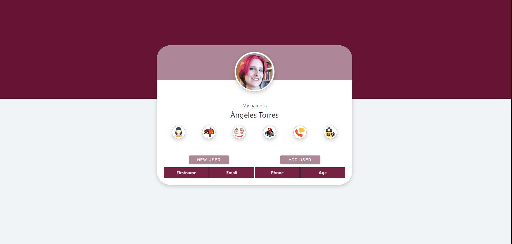

# Random User App

## Description

Project aims to create a Random User App with react and mock-apı

## Project Live
[randomuser](https://user-rndm-app.vercel.app/)

## How does my project look 

##  Tech/framework used
* React
* React Hooks(useEffect,useState)
* Axios
* SweetAlert
* CSS3
